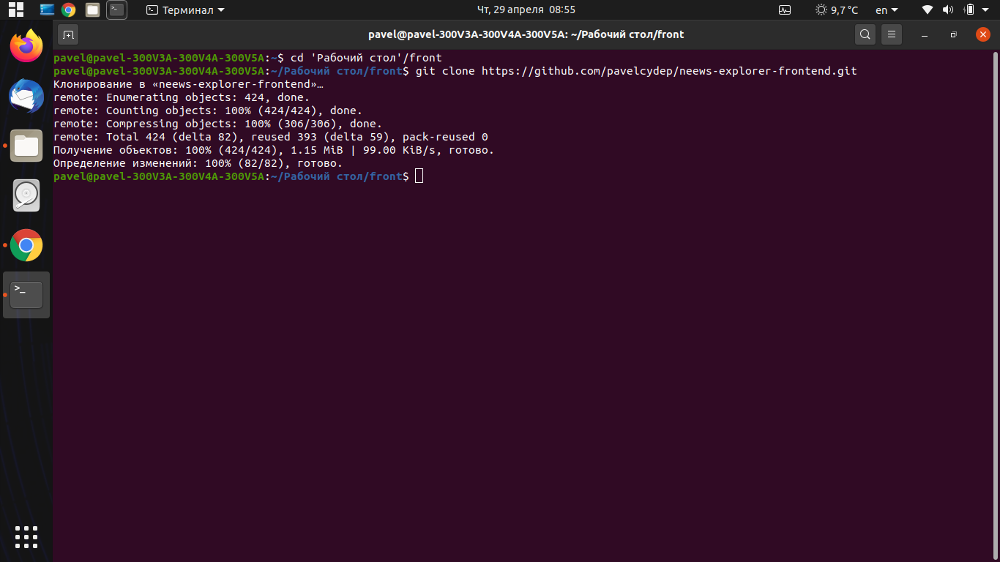

News Explorer
=============
Данный учебный проект является моей дипломной работой на курсе Веб-разработки от Яндекс.Практикума
****
[Ссылка на проект](https://pavelcydep.github.io/Russia-adaptiv-verstka/)

Возможности использования
=========================
- Поиск новостей по заданной тематике
- Регистрация/авторизация новых и уже существующих аккаунтов
- Постановка лайка и сохранение понравившихся статей в избранные

Как установить проект?
================
## Для начала работы вам необходим:

- <a href="https://nodejs.org/en/">NodeJS & npm<a> - среда выполенния кода JavaScript вне браузера. Позволяет писать серверный код для динамических веб-страниц и веб-приложений.
- <a href="https://gitforwindows.org/">Git Bash<a> если вы используете Windows OS.

## Установка

### Склонировать проект на ПК:

    git clone https://github.com/pavelcydep/neews-explorer-frontend.git
   

### Установить зависимости

    npm install

## Работа

#### Запуск демо:

    npm run dev
    
Это приведет к запуску локального сервера доступного по ссылке http://localhost:8080/, все файлы будут компилироваться в режиме разработки.
  

#### Для сборки проекта в production:

    npm run build
    
#### Для деплоя на GitHub pages:

    npm run deploy

Стек технологий
===============
%20(2).png)  
 CSS
 JS
Webpack

Планы по доработке
==================
- сделать то же самое приложение с помощью React. 

